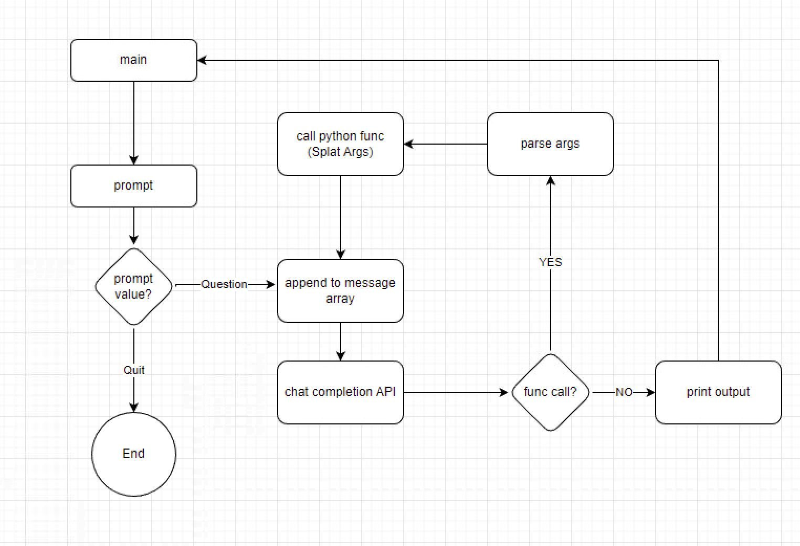

# GPT Functions

Sample code for calling ChatGPT Native JSON Functions that return values back to ChatGPT to then allow it to answer questions.

Also knows if it even needs to call a function.

Has a list of distinct functions for unique problems.

* Stock Prices
* Compare two stock market caps
* Employee info and comparison
* Google Map URL generation

## Code Flow

##Todo
* Code all hardcoded in main. 
* Will restructure to make function calling and JSON defining more structured
* Want to dynamically add functions based on situation. Perhaps give ChatGPT an intial list of all functions and then it can load what is needed to save on tokens.
